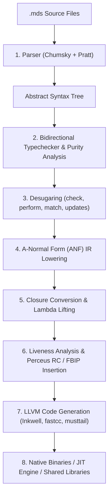

# Modus

> **A pure-by-default systems programming language with TypeScript ergonomics, Haskell-grade purity, Perceus reference counting, and LLVM native performance.**

[]()
[]()
[]()
[]()
[]()

Modus combines the syntactic clarity and rapid development feel of TypeScript with the deterministic rigor of pure functional programming and the raw speed of native systems code. It eliminates entire classes of runtime bugs through compile-time purity enforcement, strict immutability, and deterministic Perceus reference counting—all without a garbage collector or runtime system.

---

## Key Features

- **Pure by Default**: Pure functions cannot produce side effects or return `void`. Effectful functions explicitly declare `IO(T)` and unwrap effects with `perform`.
- **TypeScript Ergonomics**: Familiar syntax: `function`, `type`, structural record literals `{ x: 1, y: 2 }`, functional updates `{ ...point, x: 10 }`, and concise arrow closures `(x: i32) => x * 2`.
- **Strict Immutability & No Imperative Loops**: Variables are strictly immutable (`let`, no `mut`). Imperative loops (`while`, `for`) are prohibited; iteration is expressed through tail recursion (guaranteed LLVM `musttail` jumps), pattern matching, and higher-order functions.
- **Predictable Zero-GC Memory Management**: Heap allocations use Perceus deterministic reference counting (`[u64 rc | payload]`), borrowed parameters incur zero reference count traffic, and primitives remain unboxed.
- **Functional-But-In-Place (FBIP)**: When a record or buffer has a reference count of 1 (`rc == 1`), functional updates mutate memory in-place, achieving imperative performance with pure functional semantics.
- **Parenthesized Generics**: `Result(T, E)` and `Option(T)` replace `<>` brackets, eliminating ambiguity with relational operators in expressions.
- **Monadic Error Handling**: First-class `Result(T, E)` with the `check` operator for early error return (no runtime exceptions or hidden control flow).
- **Traits Without `dyn`**: Static dispatch (`function f(T: Drawable)(x: T)`) is monomorphized at compile time; dynamic dispatch (`item: Drawable`) uses fat pointers and vtables directly without a `dyn` keyword.
- **First-Class Developer Tooling**: Built-in native LLVM `-O3` compiler (`modus build`), fast JIT runner (`modus run`), Language Server Protocol (`modus lsp`), C FFI (`extern "C"`), and an ESM-style module system with incremental content-addressed caching.

---

## Example Program

The following Modus program highlights the core feel of the language: structural records, discriminated unions, pure tail-recursive loops, functional record updates (FBIP), pattern matching, error propagation, and standard C FFI I/O.

```typescript
// geometry_pipeline.mds
// A complete Modus program demonstrating core syntax and language semantics.

// 1. Structural records (no 'struct' keyword; typing inferred structurally)
type Point = {
    x: i32,
    y: i32,
};

// 2. Discriminated unions with parenthesized generics (never '<>')
type Option(T) = Some(T) | None;
type Result(T, E) = Ok(T) | Err(E);

// 3. C FFI: Declare foreign functions within typed IO effects
extern "C" {
    function printf(fmt: CString, val: i32): IO(i32);
    function puts(s: CString): IO(i32);
}

// 4. Pure tail-recursive loop: guaranteed zero stack growth via LLVM 'musttail'
// (Loops like 'while' and 'for' are syntax errors in Modus)
function sum_range(n: i32, acc: i32): i32 {
    if (n <= 0) {
        return acc;
    } else {
        return sum_range(n - 1, acc + n);
    }
}

// 5. Functional record update with FBIP (Functional-But-In-Place)
// Reuses heap buffer in-place when reference count is unique (rc == 1)
function move_point(p: Point, dx: i32, dy: i32): Point {
    return { ...p, x: p.x + dx, y: p.y + dy };
}

// 6. Pattern matching over discriminated unions
function validate_point(p: Point): Result(i32, String) {
    if (p.x < 0 || p.y < 0) {
        return Result.Err("Coordinates must be non-negative");
    } else {
        return Result.Ok(p.x + p.y);
    }
}

function unwrap_result(res: Result(i32, String), fallback: i32): i32 {
    return match (res) {
        Ok(v) => v,
        Err(_) => fallback,
    };
}

function unwrap_or(opt: Option(i32), fallback: i32): i32 {
    return match (opt) {
        Some(val) => val,
        None => fallback,
    };
}

// 7. Program entry point: pure by default, returns IO(void)
function main(): IO(void) {
    // Immutable variable binding (no 'mut' keyword exists)
    let origin: Point = { x: 10, y: 20 };

    // Functional update with FBIP: mutates buffer in-place when rc == 1
    let moved: Point = move_point(origin, 5, 15); // { x: 15, y: 35 }

    // Validate point with Result and unwrap via pattern matching
    let valid_coord: Result(i32, String) = validate_point(moved);
    let pt_sum: i32 = unwrap_result(valid_coord, 0); // 50

    // Tail-recursive loop (LLVM musttail optimization)
    let series: i32 = sum_range(10, 0); // 55

    // Discriminated union and pattern matching
    let opt_multiplier: Option(i32) = Option.Some(2);
    let mult: i32 = unwrap_or(opt_multiplier, 1); // 2

    // Pure arithmetic calculation
    let total_score: i32 = (pt_sum + series) * mult; // (50 + 55) * 2 = 210

    // Unboxed C FFI output via 'perform'
    let msg: CString = String.toCString("Total Pipeline Result: %d\n");
    perform printf(msg, total_score);

    return IO.pure(());
}
```

Run this program immediately using the Modus JIT compiler:

```bash
modus run examples/geometry_pipeline.mds
```

Or compile it into an optimized standalone native binary:

```bash
modus build examples/geometry_pipeline.mds -o geometry_pipeline
./geometry_pipeline
```

---

## Syntax At A Glance

Modus combines principles from several languages:

| Feature | Modus | TypeScript | Rust | Haskell |
| :--- | :--- | :--- | :--- | :--- |
| **Function keyword** | `function` | `function` | `fn` | (none) |
| **Variable binding** | `let x: T = ...` (strictly immutable) | `const` / `let` | `let` / `let mut` | `let` |
| **Iteration** | Tail recursion (`musttail`), closures | `for`, `while`, `map` | `loop`, `for`, `while` | Tail recursion, folds |
| **Generics** | `Result(T, E)`, `Option(T)` | `Result<T, E>` | `Result<T, E>` | `Result t e` |
| **Records** | `type P = { x: i32 }`, `{ x: 1 }` | `interface P { x: number }` | `struct P { x: i32 }` | Record types |
| **Record Update** | `{ ...p, x: 10 }` (FBIP in-place) | `{ ...p, x: 10 }` | `P { x: 10, ..p }` | `p { x = 10 }` |
| **Side Effects** | `IO(T)`, `perform expr` | (Unchecked / async) | (Unchecked / side-effecting) | `IO a`, `do` notation |
| **Error Handling** | `check expr` (Result early-return) | `try` / `catch` | `?` operator | `ExceptT`, `do` |
| **Memory** | Perceus RC + FBIP (Zero-GC) | Tracing V8 GC | Ownership / Borrowing | Tracing RTS GC |

### Strict Syntax Rules

1. **Functions**: Always use the `function` keyword (`fn` is a syntax error). Single-expression functions may use `=> expr`.
2. **Conditional expressions**: `if (cond)` and `else if (cond)` strictly require parentheses.
3. **Generics**: Generic parameters are parenthesized: `Option(T)`, `Map(K, V)`. Angle brackets `<>` are comparison operators only.
4. **Data types**: Types are declared with `type` (never `struct` or `enum`):
   - **Records**: `type Point = { x: i32, y: i32 };`
   - **Discriminated Unions**: `type Option(T) = Some(T) | None;`
5. **Record Instantiation**: Created structurally via `{ field: val }` directly without a type prefix: `let p: Point = { x: 1, y: 2 };`.
6. **No Imperative Loops**: `while` and `for` keywords are syntax errors. Use tail recursion with accumulators.
7. **Purity Enforcement**: Calling an effectful function or using `perform` inside a pure function is a compile error. Pure functions returning `void` are rejected (dead computations are errors).

---

## Language Guide

### 1. Variables and Types

Primitive types map directly to native unboxed machine types:

```typescript
let a: i32 = 42;
let b: f64 = 3.14159;
let flag: bool = true;
let text: String = "Hello, Modus";
let arr: [i32] = [1, 2, 3, 4];
let pair: (i32, String) = (1, "status");
```

Variables are strictly immutable. There is no `mut` keyword. To update state, pass new values to tail-recursive calls or use functional record updates:

```typescript
type Config = { host: String, port: i32, tls: bool };

let base: Config = { host: "localhost", port: 80, tls: false };
let secure: Config = { ...base, port: 443, tls: true };
```

### 2. Tail Recursion & Iteration

Modus compiles recursive calls in tail position with LLVM's `musttail` attribute, guaranteeing direct jumps in machine code without stack frame growth:

```typescript
function gcd(a: i32, b: i32): i32 {
    if (b == 0) {
        return a;
    } else {
        return gcd(b, a % b);
    }
}

function sum_list(items: [i32], idx: i32, len: i32, acc: i32): i32 {
    if (idx >= len) {
        return acc;
    } else {
        return sum_list(items, idx + 1, len, acc + items[idx]);
    }
}
```

### 3. Purity & Effects (`IO` and `perform`)

Pure functions are side-effect free and referentially transparent:

```typescript
// Pure computation: cannot perform I/O, cannot return void
function add(a: i32, b: i32): i32 => a + b;
```

Functions that interact with the outside world return `IO(T)`:

```typescript
// Effectful: performs I/O
function log_status(code: i32): IO(void) {
    let msg: CString = String.toCString("Status: %d\n");
    perform printf(msg, code);
    return IO.pure(());
}
```

The `perform` keyword unwraps an `IO(T)` into `T`. It can only be invoked inside a function that itself returns `IO(...)`.

### 4. Error Handling (`Result` and `check`)

Modus has no runtime exceptions. Fallible operations return `Result(T, E)`:

```typescript
type Result(T, E) = Ok(T) | Err(E);

function parse_port(s: String): Result(i32, String) {
    // Validation logic...
    return Result.Ok(8080);
}

function start_server(raw_port: String): Result(i32, String) {
    // 'check' unwraps Result.Ok or early-returns Result.Err
    let port: i32 = check parse_port(raw_port);
    return Result.Ok(port);
}
```

Prefix operators compose predictably:
- `check perform f()`: Executes the IO action, then checks and unwraps the `Result` (or bubbles `Err`).
- `perform check f()`: Checks the `Result` first; if `Err`, avoids executing the IO action entirely.

### 5. Traits and Polymorphism

Modus traits define interfaces for both static monomorphization and dynamic fat-pointer dispatch without requiring a `dyn` keyword:

```typescript
trait Drawable(Self) {
    function draw(self: Self): IO(void);
}

impl Drawable for Circle {
    function draw(self: Circle): IO(void) {
        // Draw circle...
        return IO.pure(());
    }
}

// Static dispatch (monomorphized at compile time):
function render_static(T: Drawable)(shape: T): IO(void) {
    perform shape.draw();
    return IO.pure(());
}

// Dynamic dispatch (fat pointer + vtable, no 'dyn' keyword):
function render_dynamic(shape: Drawable): IO(void) {
    perform shape.draw();
    return IO.pure(());
}
```

When whole-program analysis determines that a trait has only one implementer, dynamic calls are automatically devirtualized.

### 6. Modules and Exports

Modus features an ESM-style module system:

```typescript
// math.mds
export function square(x: i32): i32 => x * x;

export type Vector2D = {
    x: f64,
    y: f64,
};
```

```typescript
// main.mds
import { square, Vector2D } from "./math.mds";
import * as MathLib from "./math.mds";

function main(): IO(void) {
    let val: i32 = square(5);
    let v: Vector2D = { x: 1.0, y: 2.0 };
    return IO.pure(());
}
```

---

## Memory Model: Perceus & FBIP

Modus has no garbage collector and no stop-the-world pauses.

1. **Object Layout**: Every heap allocation (records, arrays, closures, unions) is prefixed with a 64-bit reference count header:
   ```text
   [ u64 ref_count | payload fields... ]
   ```
2. **Deterministic RC**:
   - Borrowed arguments do not alter reference counts (zero RC traffic).
   - Last-use of a variable moves the pointer directly without incrementing or decrementing.
   - Values shared across multiple branches increment their reference count at the fork.
3. **Functional-But-In-Place (FBIP)**:
   When updating a record via `{ ...record, field: value }`:
   ```c
   if (record->rc == 1) {
       // In-place mutation: no malloc, no memcpy, O(1) performance
       record->field = value;
       return record;
   } else {
       // Shared: decrement old, allocate new buffer, copy other fields
       record->rc--;
       Record* new_rec = modus_alloc(sizeof(Record));
       memcpy(new_rec, record, ...);
       new_rec->field = value;
       return new_rec;
   }
   ```

---

## Compiler Architecture

The Modus compiler is written in Rust and features a clean 8-stage pipeline:



1. **Parser**: Built with `chumsky` and Pratt precedence climbing for operators, parenthesized generics, and structural records.
2. **Typechecker**: Bidirectional type inference, trait resolution, effect validation, and dead-computation checks.
3. **Desugarer**: Rewrites `check` into explicit early-return `match` branches, converts functional record updates into FBIP branches, and lowers pattern matching.
4. **ANF Lowering**: Linearizes expressions into atomic operations with explicit temporary variables.
5. **Closure Conversion**: Captures environments into heap-allocated structs and transforms lambdas into top-level functions with environment pointers.
6. **Perceus & FBIP Pass**: Analyzes variable liveness to insert `inc_ref` and `dec_ref` calls and rewrites functional updates to check uniqueness (`rc == 1`).
7. **LLVM Backend**: Uses `inkwell` to emit LLVM IR with internal `fastcc` conventions, `musttail` tail-call optimization, and custom inline `dec_ref` fast paths.

---

## CLI & Tooling

Modus ships with a unified CLI:

```bash
Modus Compiler CLI

USAGE:
    modus run <file.mds>                        JIT execute a Modus program
    modus build <file.mds> [-o <out>]           Compile to native standalone executable
    modus build --lib <file.mds> [-o <out.so>] [--emit-header <file.mds>]
                                                Compile to shared library and emit export map
    modus emit-llvm <file.mds>                  Print optimized LLVM IR assembly
    modus lsp                                   Start Language Server Protocol (LSP) on stdio
    modus clean                                 Clean compiler cache (.modus-cache/)
    modus --demo                                Run built-in demo program
```

### JIT Execution

Run scripts directly without creating a disk binary:

```bash
modus run examples/demo.mds
```

### Native Binary Compilation

Produce optimized, standalone native executables:

```bash
modus build examples/demo.mds -o demo
./demo
```

### Shared Libraries & Header Generation

Compile reusable dynamic libraries for distribution or multi-language interop:

```bash
modus build --lib math_lib.mds -o libmath.so --emit-header math_lib.mds
```

---

## Editor Support

Modus includes official Tree-sitter grammar and query definitions located in [`editor/`](file:///home/mkarmakar/Projects/Modus/editor):

- **Helix**: Syntax highlighting, auto-indentation, text objects, and code folding (`editor/helix/queries/modus/`).
- **Zed**: Complete syntax bundle in `editor/zed/`.
- **Language Server (LSP)**: Run `modus lsp` over `stdio` from any LSP-compatible editor (VS Code, Neovim, Helix, Emacs). Features real-time type diagnostics, hover type inspections, code actions (e.g. converting `fn` to `function`), and cross-file go-to-definition.

### Configuring Helix

Add to `~/.config/helix/languages.toml`:

```toml
[[language]]
name = "modus"
scope = "source.modus"
injection-regex = "modus"
file-types = ["mds"]
roots = ["Cargo.toml", ".git"]
comment-token = "//"
indent = { tab-width = 4, unit = "    " }
language-servers = [ "modus-lsp" ]

[language-server.modus-lsp]
command = "modus"
args = ["lsp"]
```

---

## Development & Building

### Prerequisites

Modus development is configured with [devenv](https://devenv.sh/) for reproducible environments:

```bash
# Enter development shell with Rust, LLVM, and tools pre-configured:
devenv shell
```

### Building the Compiler

```bash
# Build compiler binary
cargo build

# Build with LLVM backend support
cargo build --features llvm

# Run compiler test suite
cargo test --features llvm
```

### Running Checks

Before submitting contributions, verify all tests and formatting pass:

```bash
cargo fmt --check
cargo clippy --all-targets --features llvm -- -D warnings
cargo test --features llvm
```

## Documentation & Spec

For the complete technical specification of the type system, grammar, Perceus RC mechanics, and runtime ABI, refer to the [Modus Language Specification](file:///home/mkarmakar/Projects/Modus/docs/SPEC.md).

---

## License

Modus is licensed under the MIT License.
