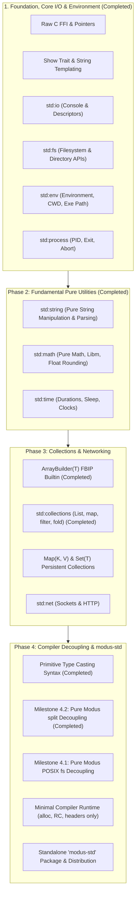

# Modus Standard Library: Architecture & Roadmap

This document specifies the architecture, implemented components, and forward-looking roadmap of the **Modus Standard Library (stdlib)**.

---

## 1. Design Principles

1. **Pure by Default**:
   - Functions with side effects must be wrapped in `IO(T)` and evaluated with `perform`.
   - Pure computations (like string formatting, list manipulations, math functions) return values directly without effects.
   - Dead pure computations returning `void` remain semantic errors.

2. **Explicit Errors (No Exceptions)**:
   - All fallible operations return `Result(T, E)`.
   - Error handling is idiomatic using the `check` keyword and pattern matching.
   - Consistent error types across domains (`IOError`, `ParseError`, etc.).

3. **Perceus Reference Counting & FBIP**:
   - All data structures leverage Functional-But-In-Place (FBIP) updates when reference count is unique (`rc == 1`), avoiding heap allocations on pure transformations.
   - Memory management requires no Garbage Collector (GC) or runtime pause.

4. **Zero-Overhead Abstractions**:
   - Syntactic sugar (such as backtick string interpolation) is desugared at parse time into binary operations and trait calls with zero runtime dispatch cost.

5. **Modular Delivery**:
   - Built-in standard modules are embedded directly into the compiler and resolved via virtual imports (`import { ... } from "std:<module>";`).
   - Extended packages and third-party libraries can be linked via the module resolution subsystem.

6. **Compiler vs. Standard Library Decoupling (`rust-std` Architecture)**:
   - The compiler's execution runtime (`runtime.rs`) must remain pure, minimal, and language-agnostic. Its sole responsibility is to provide foundational language primitives:
     - Memory allocation and deallocation (`modus_alloc`, `free`)
     - Perceus reference counting (`modus_inc_ref`, `modus_dec_ref`)
     - Primitive memory layouts and headers (refcount, length, capacity for strings and arrays)
     - Core string concatenation (`modus_str_concat`) and string equality (`modus_str_eq`)
      - Fatal panic / abort / array bounds-check handlers
   - Domain-specific logic (filesystem operations, environment inspection, process lifecycle, networking) must **never** be hardcoded into the compiler runtime. Instead, the standard library is written in pure Modus code that interacts with the operating system via low-level `Pointer(T)` operations and thin libc `extern "C"` declarations.
   - **Zero Domain Shims in Compiler Runtime**: `runtime.rs` contains **zero** domain-specific or OS-specific shims. `modus_fs_read_dir` has been completely eliminated from the compiler runtime and rewritten in 100% pure Modus in `stdlib/fs.mds` using `Pointer(u8).offset(19)`, `[String]`, and native `opendir`/`readdir`/`closedir` bindings. All transitional helpers are removed, leaving `runtime.rs` as a strictly minimal, language-agnostic Perceus + FBIP kernel.

---

## 2. Currently Implemented Modules & Subsystems

### 2.1 Low-Level C FFI Subsystem
- **FFI Syntax**:
  - `extern "C" { function name(...): Ret; }` and inline single-function `extern "C" function name(...): Ret;`.
  - Foreign Symbol Aliasing: `function c_name(...): Ret = "foreign_symbol";` binds directly to a foreign C symbol without colliding with Modus function names.
  - Mandatory `IO` Return: All `extern "C"` functions must return `IO(T)` or `IO(void)` (e.g. `extern "C" function write(fd: i32, buf: Pointer(u8), count: u64): IO(i64);`). Pure functions can and must be implemented in Modus itself, never escape-hatched from foreign C libraries, preserving language soundness.
- **Raw Memory & Pointer Primitives (`Pointer(T)`)**:
  - `Pointer.null()`: Null pointer constructor.
  - `Pointer.fromAddress(addr: u64)`: Address-to-pointer casting.
  - `ptr.read(): IO(T)`: Dereference and read value.
  - `ptr.write(val: T): IO(void)`: Write value to memory location.
  - `ptr.offset(count: i64): Pointer(T)`: Pointer arithmetic.
  - `ptr.address(): u64`: Pointer to integer address.
  - `ptr.isNull(): bool`: Null check.
  - `ptr.cast(): Pointer(U)`: Pointer reinterpretation.
  - `ptr.toString(): IO(String)`: C-string dereference to Modus string.
- **CString Interop**:
  - Type alias: `type CString = Pointer(u8)`.
  - `String.toCString(s: String): CString`: Zero-copy view of Modus string as C string.
  - `CString.toString(cs: CString): IO(String)`: Safe read from null-terminated C buffer.

### 2.2 String Conversion & Templating
- **`Show` Trait**:
  ```modus
  trait Show(Self) {
      function show(self: Self): String;
  }
  ```
  - Built-in implementations for all 12 primitive types: `i8`, `i16`, `i32`, `i64`, `u8`, `u16`, `u32`, `u64`, `f32`, `f64`, `bool`, `String`.
  - User-defined types can implement `Show`:
    ```modus
    impl Show for Point {
        function show(self: Point): String {
            return `Point(${self.x}, ${self.y})`;
        }
    }
    ```
- **String Concatenation**:
  - Binary `+` on `String` operands is lowered to `modus_str_concat` with null-safe length calculation and single-allocation buffer copying.
- **Backtick String Templating**:
  - Syntax: `` `Hello, ${name}! Your score is ${score + 1}.` ``
  - Desugared at parse time into binary `+` operations and `.show()` method calls:
    `"Hello, " + (name).show() + "! Your score is " + (score + 1).show() + "."`
  - Supports escaped expressions `\${expr}` to emit literal `${expr}` and escaped backticks `` \` ``.

### 2.3 `std:io` Module
- **Import Path**: `import { ... } from "std:io";`
- **File Descriptors**:
  - `stdin_fileno() -> 0`
  - `stdout_fileno() -> 1`
  - `stderr_fileno() -> 2`
- **Types**:
  - `type IOError = { code: i32, message: String };`
- **Standard Printing**:
  - `print(s: String): IO(void)`: Writes string to standard output.
  - `println(s: String): IO(void)`: Writes string followed by newline to standard output.
  - `eprint(s: String): IO(void)`: Writes string to standard error.
  - `eprintln(s: String): IO(void)`: Writes string followed by newline to standard error.
  - `flush(fd: i32): IO(void)`: Flushes file descriptor buffers.
- **Low-Level Byte & Line Streaming**:
  - `writeRaw(fd: i32, buf: CString, count: u64): IO(Result(u64, IOError))`
  - `readRaw(fd: i32, buf: CString, count: u64): IO(Result(u64, IOError))`
  - `readLine(): IO(Result(String, IOError))`: Reads newline-terminated line from standard input.
  - `readLineFrom(fd: i32): IO(Result(String, IOError))`: Reads newline-terminated line from specified file descriptor.

### 2.4 `std:fs` Module (Filesystem & Path Operations)
- **Import Path**: `import { ... } from "std:fs";`
- **Data Types**:
  - `type IOError = { code: i32, message: String };`
  - `type File = { fd: i32, path: String };`
  - `type OpenOptions = { read: bool, write: bool, create: bool, append: bool, truncate: bool };`
  - `type FileMetadata = { size: u64, is_file: bool, is_dir: bool, modified_at: u64 };`
- **Option Constructors**:
  - `defaultOpenOptions(): OpenOptions`: Read-only flags.
  - `readOptions(): OpenOptions`: Explicit read-only mode.
  - `writeOptions(): OpenOptions`: Write-only mode with create and truncate flags.
- **File APIs**:
  - `readFile(path: String): IO(Result(String, IOError))`: Reads entire file contents as a String.
  - `writeFile(path: String, contents: String): IO(Result(void, IOError))`: Writes full string contents, creating or truncating.
  - `appendFile(path: String, contents: String): IO(Result(void, IOError))`: Appends string to end of file, creating if nonexistent.
  - `openFile(path: String, options: OpenOptions): IO(Result(File, IOError))`: Opens file with specified POSIX flags.
  - `closeFile(file: File): IO(Result(void, IOError))`: Closes file handle.
  - `removeFile(path: String): IO(Result(void, IOError))`: Unlinks file from filesystem.
  - `copyFile(src: String, dest: String): IO(Result(u64, IOError))`: Copies data in 64KB chunks and returns total bytes copied.
  - `renameFile(from: String, to: String): IO(Result(void, IOError))` (and alias `rename`): Atomic rename of file or directory.
- **Directory APIs**:
  - `createDir(path: String): IO(Result(void, IOError))`: Creates directory with standard permissions (0777).
  - `removeDir(path: String): IO(Result(void, IOError))`: Removes empty directory.
  - `readDir(path: String): IO(Result([String], IOError))`: Enumerates directory entries excluding `.` and `..`.
- **Path & Metadata Utilities**:
  - `exists(path: String): IO(bool)`: Tests whether path exists.
  - `metadata(path: String): IO(Result(FileMetadata, IOError))`: Inspects file size, type (file vs directory), and modification timestamp.

### 2.5 `std:env` Module (Environment & Path Inspection)
- **Import Path**: `import { ... } from "std:env";`
- **Data Types**:
  - `type IOError = { code: i32, message: String };`
- **Environment Operations**:
  - `getEnv(key: String): IO(Result(String, IOError))`: Retrieves the value of an environment variable.
  - `setEnv(key: String, value: String): IO(Result(void, IOError))`: Sets or updates an environment variable.
  - `removeEnv(key: String): IO(Result(void, IOError))`: Unsets an environment variable.
- **Working Directory & Executable Path**:
  - `currentDir(): IO(Result(String, IOError))`: Returns current working directory.
  - `setCurrentDir(path: String): IO(Result(void, IOError))`: Changes current working directory.
  - `tempDir(): IO(String)`: Returns system temporary directory (inspects `TMPDIR`, `TMP`, `TEMP`, defaults to `/tmp`).
  - `currentExe(): IO(Result(String, IOError))`: Returns the path of the currently executing binary via `/proc/self/exe`.

### 2.6 `std:process` Module (Process Lifecycle & Metadata)
- **Import Path**: `import { ... } from "std:process";`
- **Process Metadata**:
  - `pid(): IO(i32)`: Returns current process ID.
  - `parentPid(): IO(i32)`: Returns parent process ID.
- **Process Termination**:
  - `exit(code: i32): IO(void)`: Terminates process immediately with the specified exit code.
  - `abort(): IO(void)`: Aborts process abnormally.

### 2.7 `std:string` Module (Pure String Algorithms & Parsing)
- **Import Path**: `import { ... } from "std:string";`
- **String Inspection & Character Access**:
  - `length(s: String): i64`: Returns byte length of string.
  - `isEmpty(s: String): bool`: Returns whether string is empty.
  - `charAt(s: String, index: i64): String`: Character at given index.
  - `charCodeAt(s: String, index: i64): i64`: Byte/ASCII code at index.
  - `fromCharCode(code: i64): String`: Single-character string from code (100% pure Modus).
- **Substrings & Slicing**:
  - `substring(s: String, start: i64, end: i64): String`
  - `slice(s: String, start: i64, end: i64): String`: Slice supporting negative indices.
- **Search & Matching**:
  - `indexOf(s: String, search: String): i64`
  - `lastIndexOf(s: String, search: String): i64`
  - `includes(s: String, search: String): bool`
  - `startsWith(s: String, prefix: String): bool`
  - `endsWith(s: String, suffix: String): bool`
- **Transformations & Padding**:
  - `toLowerCase(s: String): String` (100% pure Modus)
  - `toUpperCase(s: String): String` (100% pure Modus)
  - `trim(s: String): String`
  - `trimStart(s: String): String`
  - `trimEnd(s: String): String`
  - `repeat(s: String, count: i64): String`
  - `padStart(s: String, targetLen: i64, pad: String): String`
  - `padEnd(s: String, targetLen: i64, pad: String): String`
  - `replace(s: String, pattern: String, replacement: String): String`
  - `replaceAll(s: String, pattern: String, replacement: String): String`
- **Dynamic Splitting & Joining**:
  - `split(s: String, delimiter: String): [String]`: Pure Modus string splitting using `ArrayBuilder(String)` (zero compiler runtime helpers).
  - `join(arr: [String], delimiter: String): String`: Concatenates array of strings with delimiter.
- **Parsing**:
  - `parseInt(s: String): Result(i64, String)`: Parses signed integer with error reporting.
  - `parseFloat(s: String): Result(f64, String)`: Parses floating-point number.

### 2.8 `std:math` Module (Pure Mathematics & Trigonometry)
- **Import Path**: `import { ... } from "std:math";`
- **Mathematical Constants**:
  - `PI: f64`, `E: f64`, `LN2: f64`, `LN10: f64`, `LOG2E: f64`, `LOG10E: f64`, `SQRT2: f64`, `SQRT1_2: f64`
- **Rounding & Clamping**:
  - `floor(x: f64): f64`, `ceil(x: f64): f64`, `round(x: f64): f64`, `trunc(x: f64): f64`
  - `fround(x: f64): f64`: IEEE 754 32-bit float rounding via pure Modus `(x as f32) as f64`.
  - `clamp(x: f64, lower: f64, upper: f64): f64`
- **Powers, Roots & Logarithms**:
  - `sqrt(x: f64): f64`, `cbrt(x: f64): f64`, `pow(base: f64, exp: f64): f64`, `hypot(x: f64, y: f64): f64`
  - `exp(x: f64): f64`, `expm1(x: f64): f64`, `log(x: f64): f64`, `log2(x: f64): f64`, `log10(x: f64): f64`, `log1p(x: f64): f64`
- **Trigonometry & Hyperbolic Functions**:
  - `sin`, `cos`, `tan`, `asin`, `acos`, `atan`, `atan2`
  - `sinh`, `cosh`, `tanh`, `asinh`, `acosh`, `atanh`
- **Bitwise & Integer Helpers**:
  - `clz32(x: i32): i32`: Count leading zero bits.
  - `imul(a: i32, b: i32): i32`: C-like 32-bit integer multiplication.
- **Randomness**:
  - `random(): IO(f64)`: Pseudo-random floating-point value in `[0.0, 1.0)`.

### 2.9 `std:time` Module (Clocks, Instants & Durations)
- **Import Path**: `import { ... } from "std:time";`
- **Types**:
  - `type Duration = { nanos: u64 };`
  - `type Instant = { nanos: u64 };`
- **Duration Constructors & Conversions**:
  - `durationFromNanos(nanos: u64): Duration`
  - `durationFromMicros(micros: u64): Duration`
  - `durationFromMillis(millis: u64): Duration`
  - `durationFromSecs(secs: u64): Duration`
  - `durationToNanos(d: Duration): u64`, `durationToMillis(d: Duration): u64`, `durationToSecs(d: Duration): f64`
- **Instant Operations**:
  - `instantFromNanos(nanos: u64): Instant`
  - `instantElapsed(i: Instant): IO(Duration)`
  - `instantDiff(a: Instant, b: Instant): Duration`
- **System Clocks & Sleep**:
  - `nowNanos(): IO(u64)`: Monotonic epoch clock in nanoseconds.
  - `nowMillis(): IO(u64)`: Monotonic epoch clock in milliseconds.
  - `now(): IO(Instant)`: Current monotonic timestamp instant.
  - `sleep(duration: Duration): IO(void)`: Suspends execution for specified duration.
  - `sleepMillis(millis: u64): IO(void)`: Suspends execution for specified milliseconds.

### 2.10 Unified `[T]` Dynamic Array Primitive & `std:collections` Module
- **Universal `[T]` Primitive Array & FBIP Semantics**:
  - In Modus, `[T]` is the universal growable dynamic collection primitive, uniformly managed by Perceus reference counting with Functional-But-In-Place (FBIP) mechanics. `ArrayBuilder(T)` is an alias for `[T]`.
  - **Constructors**:
    - `Array.new(): [T]` (alias `ArrayBuilder.new()`): Creates an empty array with initial capacity (4 slots).
    - `Array.withCapacity(cap: i64): [T]` (alias `ArrayBuilder.withCapacity(cap)`): Pre-allocates buffer for at least `cap` elements.
  - **FBIP Primitive Methods on `[T]`**:
    - `arr.push(val: T): [T]`: Appends element. If uniquely referenced (`rc == 1`), in-place mutation without reallocation (doubling capacity when full). If shared (`rc > 1`), copy-on-write clone.
    - `arr.set(index: i64, val: T): [T]`: Purely functional indexed update. If uniquely referenced (`rc == 1`), modifies in-place and drops replaced heap element. If shared (`rc > 1`), copy-on-write clone.
    - `arr.pop(): [T]`: Purely functional pop. Returns updated array with `length - 1`. If uniquely referenced (`rc == 1`), decrements length in-place and drops popped heap element. If shared (`rc > 1`), copy-on-write clone.
    - `arr.length(): i64`: Current element count.
    - `arr.capacity(): i64`: Allocated capacity.
    - `arr.isEmpty(): bool`: Returns `true` if `length == 0`.
    - `arr.build(): [T]`: Identity / zero-cost operation on `[T]`.
- **Import Path**: `import { ... } from "std:collections";`
- **`List(T)` Functional Singly-Linked List**:
  - `type List(T) = Cons({ head: T, tail: List(T) }) | Nil;`
  - `toList(arr: [T]): List(T)`: Converts array to immutable linked list.
  - `toArray(list: List(T)): [T]`: Converts linked list to array via `[T]`.
- **Higher-Order Array Utilities**:
  - `map(arr: [T], f: (T) => U): [U]`: Applies transformer to each element.
  - `filter(arr: [T], pred: (T) => bool): [T]`: Retains elements satisfying predicate.
  - `fold(arr: [T], init: Acc, f: (Acc, T) => Acc): Acc`: Left-associative accumulator.
  - `reduce(arr: [T], f: (T, T) => T): Result(T, String)`: Reduces non-empty array.
  - `find(arr: [T], pred: (T) => bool): Option(T)`: Returns first matching element.
  - `findIndex(arr: [T], pred: (T) => bool): i64`: Returns index of first match or `-1`.
  - `any(arr: [T], pred: (T) => bool): bool`: Tests if any element satisfies predicate.
  - `all(arr: [T], pred: (T) => bool): bool`: Tests if all elements satisfy predicate.
  - `slice(arr: [T], start: i64, end: i64): [T]`: Subarray slice supporting negative bounds.
  - `concat(a: [T], b: [T]): [T]`: Concatenates two arrays.
  - `reverse(arr: [T]): [T]`: Reverses array order.

---

## 3. Standard Library Roadmap: What to Build Next



---

### Phase 4: Compiler Decoupling & `modus-std` Architecture

#### 8. Vision: The `rustc` / `rust-std` Separation Model
In mature systems compilers such as Rust (`rustc`), the compiler itself maintains a strict boundary from standard libraries:
- `rustc` compiles code and provides minimal internal runtime symbols (`rust_begin_panic`, intrinsic memory operations, eh personality).
- `rust-std` (along with `core` and `alloc`) is written in pure Rust with `extern "C"` blocks, distributed as precompiled artifacts or source, and linked cleanly against user code.

Modus follows this exact model. The compiler runtime (`src/backend/runtime.rs`) is being stripped of all domain-specific logic, leaving only a lean, language-essential kernel:
- **What stays in the compiler runtime**:
  - Memory allocation and deallocation (`modus_alloc`, `modus_free`).
  - Perceus reference counting (`modus_inc_ref`, `modus_dec_ref`).
  - Core header layouts (Perceus RC header `[rc: i64]`, string `[rc, len, cap, chars]`, array `[rc, len, cap, ptr, elements]`).
  - Primitive string operations (`modus_str_concat`, `modus_str_eq`).
  - Fatal panic / abort / array bounds-check handlers.
- **What must be stripped out of the compiler**:
  - `modus_fs_read_dir` and any future domain helpers.
  - POSIX directory handling, file descriptors, environment inspection, network sockets, process spawning.

#### 9. Current Status: Zero Transitional Helpers
Following the completion of universal `[T]` dynamic arrays, pure Modus directory reading, pure Modus string splitting, and foreign symbol aliasing, **zero** transitional helpers remain in `src/backend/runtime.rs`:
- All filesystem logic (including `readDir`, `rename`, `copyFile`) is 100% pure Modus.
- `modus_fs_read_dir` has been **completely eliminated** from `runtime.rs`.

> [!NOTE]
> - `modus_fs_read_dir` has been **completely eliminated** from the compiler runtime. In `stdlib/fs.mds`, `readDir` is implemented in 100% pure Modus using `Pointer(u8).offset(19)`, `[String]`, and native `opendir`/`readdir`/`closedir` bindings.
> - `modus_fs_rename` has been **completely eliminated** from the compiler runtime. In `stdlib/fs.mds`, `renameFile` / `rename` binds directly to libc `rename` via native FFI foreign symbol aliasing (`function c_rename(...): IO(i32) = "rename";`).
> - `modus_str_split` has been **completely eliminated** from the compiler runtime. In `stdlib/string.mds`, `split` is implemented in 100% pure Modus using `[String]` with zero runtime overhead.
> - String transformations `toLowerCase`, `toUpperCase`, and character generator `fromCharCode` are implemented in 100% pure Modus using tail-recursive loops with zero runtime additions.
> - Floating-point rounding `fround` is implemented in 100% pure Modus via native `(x as f32) as f64`. The `modus_fround` helper has been completely eliminated from the compiler runtime.

#### 10. Decoupling Prerequisites
All decoupling prerequisites are now met:
1. **Platform-Specific C Struct / Pointer Offsetting in Pure Modus [COMPLETED]**:
   - Defining C-struct layouts or using pointer offset primitives: `dirent_ptr.offset(19)`.
2. **Universal Dynamic Collections (`[T]` / `Array`) [COMPLETED]**:
   - Universal `[T]` primitive type with Perceus FBIP in-place mutation and zero-copy `.build()`, fully integrated into typechecker, desugaring, ANF/IR, and LLVM backend.
3. **Explicit Type Casting / Numeric Conversion Syntax [COMPLETED]**:
   - Language syntax `expr as Type` implemented across AST, parser, typechecker, ANF/IR, and LLVM backend.
4. **Foreign Symbol Aliasing in `extern "C"` [COMPLETED]**:
   - Foreign symbol aliasing (`function c_fn(...): IO(T) = "foreign_sym";`) directly binds libc functions without name clashing or runtime shims.
5. **Pure Modus libc / POSIX Declarations [COMPLETED]**:
   - All `opendir`, `readdir`, `closedir`, `stat`, and other POSIX declarations reside in `stdlib/` Modus files without compiler backend involvement.

#### 11. Decoupling Milestones
- **Milestone 4.1: Pure Modus POSIX Re-implementation [COMPLETED]**:
  - Rewrote `readDir` in `stdlib/fs.mds` using pure Modus pointer operations, `[String]`, and libc calls.
  - Removed `modus_fs_read_dir` from `src/backend/runtime.rs`.
- **Milestone 4.2: Pure Modus Dynamic Array Splitting & Direct Libc Rename [COMPLETED]**:
  - Replaced `modus_str_split` with pure Modus `split` in `stdlib/string.mds` leveraging `[String]`.
  - Replaced `modus_fs_rename` with direct libc `rename` via foreign symbol aliasing.
  - Removed `modus_str_split`, `modus_fs_rename`, `puts_fn`, and `printf_fn` from `src/backend/runtime.rs`.
- **Milestone 4.3: Strip `src/backend/runtime.rs` to Minimal Kernel [COMPLETED]**:
  - Audited compiler runtime exports to verify zero OS-specific or domain-specific symbols remain.
  - Purged `strcmp_fn`, `fs_read_dir_fn`, and legacy `array_builder_*` wrappers.
  - `runtime.rs` is now strictly restricted to foundational primitives: Perceus memory management, universal `[T]` array FBIP primitives, and core string operators.
  - Support a minimal, dependency-free runtime suitable for bare-metal / embedded targets (`no_std`).
- **Milestone 4.4: Standalone `modus-std` Packaging**:
  - Decouple `stdlib/*.mds` into an independent package (`modus-std`) with its own versioning, tests, and build pipeline.
  - The Modus compiler resolves `modus-std` via the standard module resolution pipeline (or a `--sysroot` flag) rather than hardcoding embedded strings inside the compiler binary.

---

## 4. Next Priorities: Phase 3 & Remaining Decoupling

1. **Phase 3 Expansion**:
   - Persistent collections: Immutable `Map(K, V)` and `Set(T)`.
   - Networking: `std:net` (TCP streams, listeners, UDP sockets, and HTTP client primitives).
2. **Decoupling Milestone 4.1**:
   - Struct offsetting / FFI struct layout support in pure Modus.
   - Decouple `readDir` and `rename` in `std:fs` to eliminate the final two transitional helpers in `src/backend/runtime.rs`.
